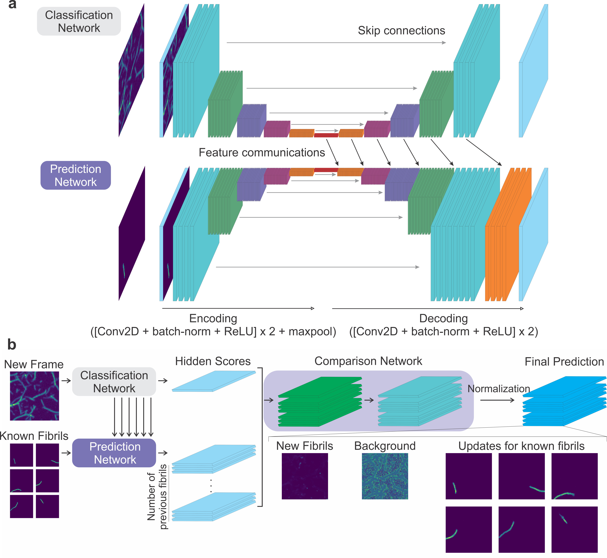

# FNet

FNet is a neural network designed for intensity-based separation of overlapping transparent objects using temporal information of a sequence of images. It was developed for the analysis of the growth of amyloid-beta fibrils, but can also be used for separation of any arbitrary objects.

## Dependencies
* Python 3.6+
* TensorFlow 1.14

## Architecture


The new neural network consists of four sub-networks: 1) Classification network, 2) Growth prediction network, 3) Background prediction network, and 4) Comparison network (see figure). The overall information flow is as follows: first the classification network encodes features from a new input image and decodes them into feature maps of different resolution. The growth prediction network encodes features of individual known molecules from the previous image, and then decodes them together with the feature maps of the same resolution from the classification network which contains the information of the new image. The background prediction network has the same structure with the prediction network, but it takes the previous background image as an input and uses indepencent weights. The classification, the growth prediction and the background prediction networks generate single feature image outputs which stand for their prediction power for how many photons of each pixel result from new molecules, known molecules, and background, respectively. Then, the comparison network, which has 3 convolution layers and 3 activation layers, compares relative prediction powers from the prediction networks and generates photon count images of known fibrils, newly-appearing fibrils, and background.

### Classification network and prediction network
The base structure of the classification network and the predictions networks is U-Net [1] like deep encoder-decoder networks. The classification network takes a photon count image as an input (160 × 160 × 1, 10 pixels were padded to the original image of 150 × 150 × 1 pixels in our analysis) and the growth prediction network takes photon count images of individual fibrils from the previous frame as inputs (126 images in our analysis). The encoding blocks (convolution, batch-normalization, rectified linear unit (ReLU) activation, and max pooling) of the classification network encodes 4 features (160 × 160 × 4). The following encoder blocks reduce the image width and height by half and add 4 additional features. The decoder blocks are similar to the encoder blocks, but double the image width and height and reduce the number of features by 4. This number of features can be adjusted by `base_feature` parameter. The decoder block also have skip connections with the encoder blocks. The prediction networks have the same structure as that of the classification network, but decoder blocks are connected with the decoder blocks of the classification network (feature communications). The background prediction network has the same structure as that of the growth prediction network, but with independent weights.

### Comparison Network
Each input from the classification network and the prediction networks generate single channel image output. The comparison network takes these images as an input and generates final result images by applying the operations of a convolution, a batch-normalization, and an ReLU activation twice, followed by a convolution and a PReLU activation. The result is photon count prediction images of newly-appearing fibrils, background, and updated known fibrils in the new image frame. The result images were then normalized pixel-by-pixel so that the number of photons of a pixel of the summed result image is equal to that of the corresponding pixel of the original input image.

## Making a FNet model instance
```Python
from FNet import FNet
base_feature = 4 # depending on the complexity of objects
max_objects = 126 # maximum number of objects in an image
img_width = 160
img_height = 160
input_shape = (img_width, img_height, max_objects + 2)

model=FNet(base_feature, input_shape)
```
You can use this model instance for training and prediction using TensorFlow.

[1] T. Falk et al., U-Net: deep learning for cell counting, detection, and morphometry. Nat. Methods. 16, 67–70 (2019).
